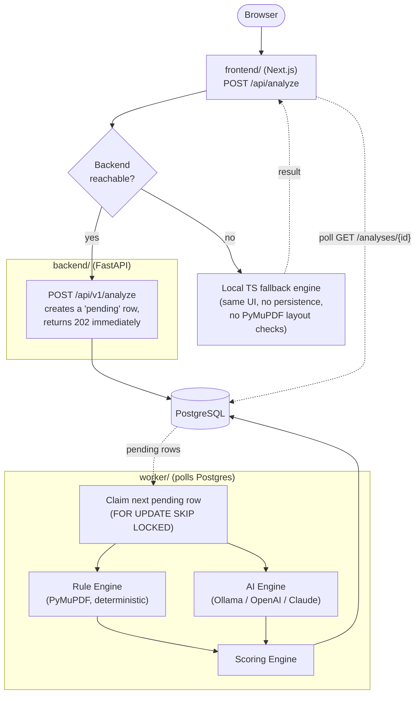

# AI ATS Checker

Upload a resume and a job description, get back an explainable ATS
compatibility score, keyword-level highlighting on the resume itself, and
prioritized, actionable recommendations - powered by a deterministic rule
engine plus a pluggable AI semantic engine (Ollama by default, OpenAI/Claude
optional).



## Three pieces, one product

| | [`frontend/`](frontend/README.md) | [`backend/`](backend/README.md) | [`worker/`](worker/README.md) |
|---|---|---|---|
| Stack | Next.js 16, TypeScript, Tailwind v4 | FastAPI, PostgreSQL, SQLAlchemy/Alembic | Python, same DB - no HTTP server |
| Job | Upload UI, JD input, progress, score dashboard, highlighted resume, report, recommendations, PDF export | REST API: create resumes/JDs, queue a check, persist + serve results | Polls for queued checks and actually runs them - PyMuPDF rule engine + pluggable AI engine |
| Standalone? | Yes - has its own complete fallback analysis engine, works with zero backend | Yes - a plain REST API, usable by anything, not just this frontend | No - does nothing without the backend's DB and schema |

**Checks run asynchronously.** `POST /api/v1/analyze` doesn't run the (often
10-20s+) AI engine call inline - it creates a `status="pending"` row and
returns immediately. `worker/` polls Postgres, claims pending rows (`SELECT
... FOR UPDATE SKIP LOCKED`, so multiple worker instances never grab the same
one), runs the actual pipeline, and writes the result. The frontend polls
`GET /api/v1/analyses/{id}` until the status settles to `complete` or
`failed` - see [`lib/api/backend-client.ts::runBackendAnalysis`](frontend/src/lib/api/backend-client.ts).

The frontend calls the backend when it's reachable (the backend's result is
authoritative - real layout analysis, real LLM judgment, persisted history)
and transparently falls back to its own local engine when it isn't, so the
app never simply breaks because a service is down. Every result is labeled
with which engine actually produced it. See
[frontend/README.md § How analysis works](frontend/README.md#how-analysis-works)
for the integration details, and [worker/README.md](worker/README.md) for
why it's a separate process polling Postgres rather than a real message
queue.

## Quickstart (full stack)

Prerequisites: Node.js >= 22.13, Python 3.12+, a running PostgreSQL server,
and (optional, for the default AI engine) a running [Ollama](https://ollama.com)
daemon with a model pulled (`ollama pull llama3.1`).

```bash
# Backend (API)
cd backend
python3 -m venv .venv && source .venv/bin/activate
pip install -r requirements-dev.txt
cp .env.example .env
createdb ats_checker
alembic upgrade head
uvicorn app.main:app --reload --port 8000 &

# Worker (reuses the backend's venv - see worker/README.md)
cd ..
cp worker/.env.example worker/.env
PYTHONPATH=backend backend/.venv/bin/python worker/main.py &

# Frontend
cd frontend
npm install
cp .env.example .env.local
npm run dev
```

Or via Docker - `docker compose up` brings up Postgres, the API, and the
worker together (copy `backend/.env.example` -> `backend/.env` and
`worker/.env.example` -> `worker/.env` first).

Open [http://localhost:3000](http://localhost:3000). Skip the backend/worker
steps entirely and the frontend still works, using its local fallback engine
- a check just won't be persisted or use the PyMuPDF-based rule engine.

Full setup, environment variables, scripts, tests, and architecture details
live in each part's own README: [frontend/README.md](frontend/README.md),
[backend/README.md](backend/README.md), [worker/README.md](worker/README.md).

## Status

Frontend, backend, and worker are all independently functional and wired
together as described above. Not yet built: authentication (the `users`
table is identification-by-email, not real auth), PDF-coordinate-based
inline highlighting (the backend captures real word/table/image positions
via PyMuPDF; nothing consumes them yet), production deployment (the
`Dockerfile`s and `docker-compose.yml` exist but nothing is deployed), and
crash recovery for a job stuck mid-processing (see worker/README.md's known
limitation).
